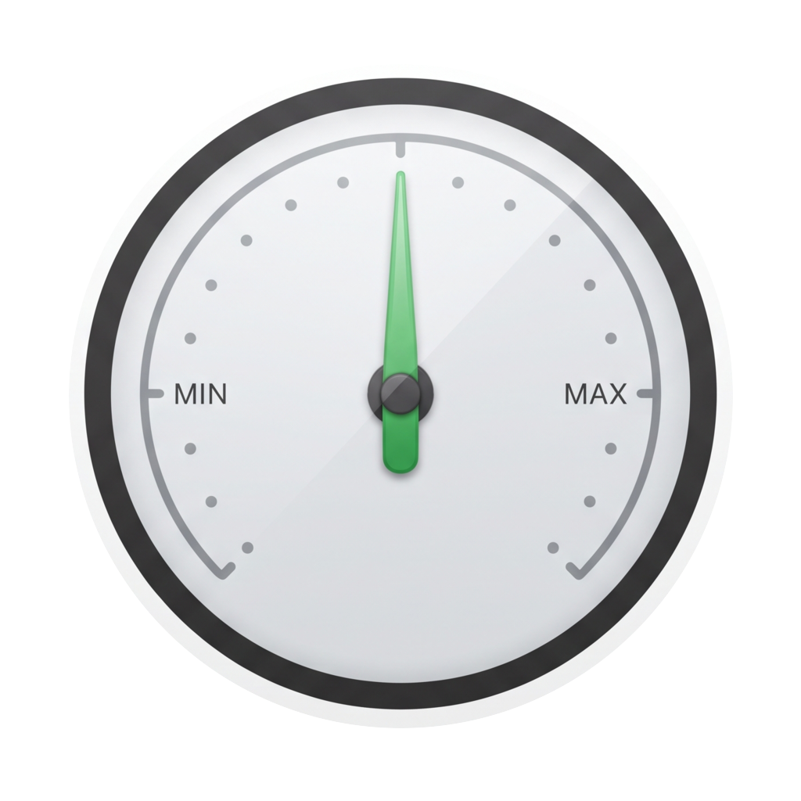

<p align="center">
  
</p>

# Tempra

**Keep background apps from taking over your Mac.**

Tempra is a free, open-source macOS menu bar app that limits or pauses
background apps to reduce CPU use and save power. You set a rule for each app.
Tempra applies the rule when the app is no longer frontmost and restores the app
when you return to it.

## Features

### Control background apps

- Limit an app to a percentage of one logical CPU core.
- Pause an app in the background and resume it in the foreground.
- Run an app on power-saving CPU cores, with or without a CPU limit.
- Apply a rule only when an app is hidden or after a set delay.
- Wait while an app plays audio before applying its rule.
- Hide or quit an app after a set period in the background.
- Disable individual rules, snooze them, or adjust them with management profiles.

### See what your Mac is doing

- View total CPU use and separate values for performance and efficiency cores.
- Check current CPU use, the rolling one-minute average, and estimated power use
  for each app.
- Review persistent CPU history for the last 5 minutes, 1 hour, or 24 hours.
- Read the CPU temperature through AppleSMC without root access.
- Record the time that Tempra pauses or limits each app.
- Receive optional high-CPU notifications with quick actions.

Tempra stops periodic monitoring when its panels are closed by default. Enable
**Continuous Monitoring** to keep CPU history and high-CPU alerts active.

## How rules work

1. Open Tempra from the menu bar.
2. Select a running app.
3. Choose a CPU limit, pause action, or idle action.
4. Set the conditions for the rule.

Tempra saves rules by bundle identifier. It restores controlled processes when
you return to an app, turn off management, or quit Tempra normally.

## Safety

Tempra manages ordinary apps owned by the current user. It does not manage
root-owned processes, daemons, background services, or protected macOS
processes. You can show these processes in the menu, but they remain
monitor-only.

Before Tempra pauses a process, an independent watchdog records its process ID
and start time. The watchdog resumes only matching paused processes if Tempra
exits unexpectedly. Tempra blocks a normal quit and shows an error if it cannot
restore every managed process.

Tempra validates saved rules, preferences, history, and management records
before it starts process management. If saved data is invalid, Tempra preserves
the stored bytes, shows an error, and stops startup. If a later save fails,
Tempra shows an error and does not treat the failed write as successful.

## Requirements

- macOS 14.2 or later
- Swift 5.10 or later

## Build from source

Run this command from the repository root:

```sh
./script/build_and_run.sh
```

The script makes an optimized release build, creates and ad-hoc signs
`dist/Tempra.app`, and opens the app.

Use a different mode when necessary:

```sh
./script/build_and_run.sh --build-only  # Build without opening the app
./script/build_and_run.sh --debug       # Build a debug version and open LLDB
./script/build_and_run.sh --logs        # Open the app and stream its logs
./script/build_and_run.sh --telemetry   # Open the app and stream its telemetry
./script/build_and_run.sh --verify      # Build, open, and check that Tempra runs
```

Run the test suite with:

```sh
swift test
```

## License

Tempra is available under the [GNU General Public License v3.0](LICENSE).
See [Third-Party Notices](THIRD_PARTY_NOTICES.md) for sensor implementation
acknowledgements.
