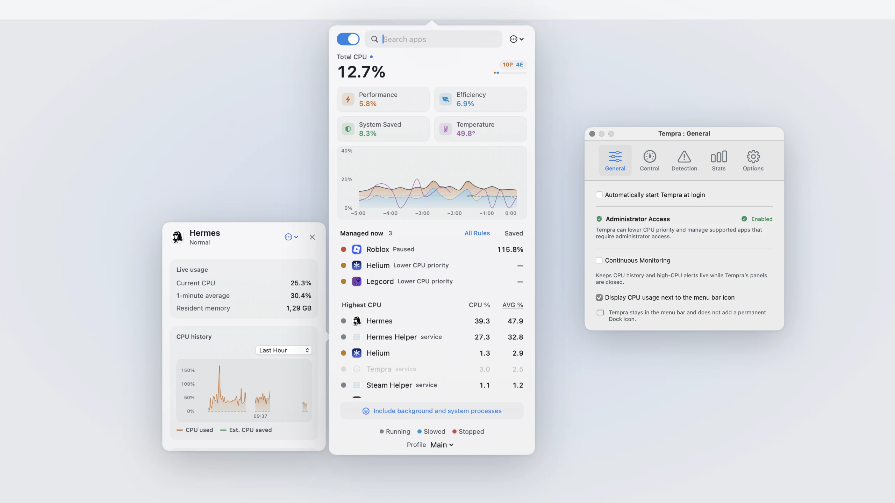
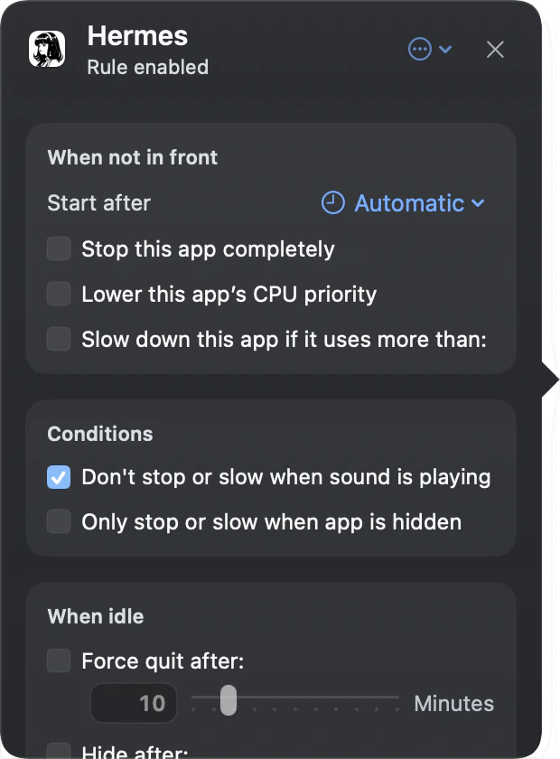
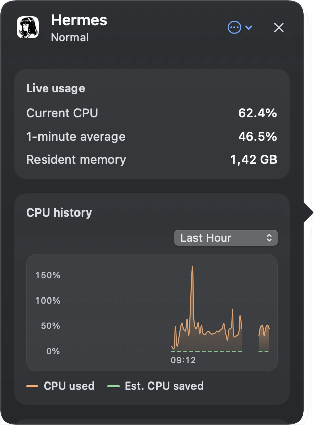

<p align="center">
  
</p>

<h1 align="center">Tempra</h1>

<p align="center"><strong>Keep background apps from taking over your Mac.</strong><br>
A free menu bar app that slows down, pauses, or deprioritizes apps while you are not using them, and gives them back the moment you switch to them.</p>

<p align="center">
  <a href="https://github.com/AxxzyWasTaken/Tempra/releases/latest"></a>
  
  <a href="LICENSE"></a>
  <a href="https://github.com/AxxzyWasTaken/Tempra/actions/workflows/ci.yml"></a>
</p>

<p align="center">
  <picture>
    <source media="(prefers-color-scheme: dark)" srcset="docs/screenshots/hero-dark.webp">
    
  </picture>
</p>

<p align="center">
  <a href="https://github.com/AxxzyWasTaken/Tempra/releases/latest"><strong>Download the latest DMG</strong></a>
  &nbsp;·&nbsp;
  <a href="#install">Install</a>
  &nbsp;·&nbsp;
  <a href="#build-from-source">Build from source</a>
</p>

## Why

Chrome with forty tabs, a game you alt-tabbed out of, an Electron chat app: they all keep burning CPU after you stop looking at them. Your fans spin up, your battery drains, and the app you are actually using gets slower. Tempra watches which app is in front and applies a rule you set to everything else. When you come back to an app, it is running at full speed before the window finishes appearing.

It is an open-source alternative to App Tamer. Same idea, no license fee, and the code is here if you want to see exactly what it does to your processes.

## Install

1. Download the DMG from the [latest release](https://github.com/AxxzyWasTaken/Tempra/releases/latest) and drag Tempra to Applications.
2. Open it. macOS will refuse the first time, because the build is signed but not notarized. Open System Settings, go to Privacy & Security, scroll down and click Open Anyway. You only do this once.
3. Tempra lives in the menu bar. Click the CPU percentage to open it.

Lowering an app's CPU priority and managing processes owned by other users need an administrator helper. Setup offers to install it, and you can add or remove it later in Settings under Administrator Access. Everything else works without it.

## What it does

Pick an app in the list and choose what happens when it leaves the front:

- Slow it down to a CPU limit, anywhere from 1% of one core up to the whole machine.
- Pause it outright. It resumes when you switch back.
- Lower its CPU priority so macOS schedules it on the efficiency cores, with or without a limit.
- Hide it or quit it after it has been in the background for a while.

You can also say when the rule starts: immediately, after a delay, or only once the app is hidden. Tempra holds off while an app is playing audio, so your music does not stutter because Spotify lost focus.

Rules are saved per app. Profiles hold a second set of limits, for example a stricter one for battery, and switch by hand or by power source or idle time. If a rule is getting in the way, pause everything for 15 minutes, 1 hour, or 4 hours from the menu.

The panel itself is a small activity monitor: total CPU split by performance and efficiency cores, per-app CPU with a one-minute average, CPU temperature read from the SMC without root, and up to 24 hours of history. Open any app to see its subprocesses, memory, and its own CPU graph. Seven days of rule activity are kept so you can see how much an app was actually throttled. If something you have not set a rule for sits at high CPU in the background, Tempra shows an in-app alert with a one-click limit. No notification permission needed.

<table align="center">
  <tr>
    <td align="center" valign="top"></td>
    <td align="center" valign="top"></td>
  </tr>
  <tr>
    <td align="center"><sub>The rule editor for one app</sub></td>
    <td align="center"><sub>The activity inspector for the same app</sub></td>
  </tr>
</table>

When the panel is closed, Tempra samples only what the menu bar number, automatic profiles, and active rules need. Turn on Continuous Monitoring in Settings if you want history and alerts to keep running in the background too.

## How it stays safe

Stopping other people's processes is the kind of thing that goes wrong at the worst moment, so most of the code is about the failure cases.

Before Tempra pauses anything, a separate guardian process writes the target's process ID and start time to a journal on disk and confirms the write. Only then does the stop signal go out. The guardian holds a five-second lease that Tempra renews every second. If Tempra crashes, hangs, or gets killed, the lease expires and the guardian resumes everything in its journal. If the guardian itself dies, launchd restarts it and it resumes everything before accepting new work. Resume signals are only sent when the process ID and start time still match, so a reused PID never gets a stray SIGCONT.

The administrator helper follows the same pattern for privileged processes and sets its own resume deadlines for CPU-limit pulses. If Tempra cannot restore every managed process on quit, it refuses to quit normally and tells you why, with a Quit Anyway that still hands the cleanup to the guardian.

Some things are never touched: WindowServer, Finder, Dock, SystemUIServer, loginwindow, WindowManager, and the audio components of apps that route system sound. They show up in the list so you can see their CPU, but no rule applies to them.

If Tempra finds corrupt saved data on launch it stops and shows an error instead of guessing. It never overwrites the bad file.

## Build from source

You need macOS 14.2, Swift 5.10, and any Apple code-signing identity (a free Apple Development one is enough).

```sh
./script/build_and_run.sh
```

This makes a release build, embeds Sparkle and the guardian and helper, signs everything with the first identity it finds, writes `dist/Tempra.app`, and opens it. Set `CODE_SIGN_IDENTITY="Apple Development: Your Name (TEAMID)"` to pick a specific one.

Other modes:

```sh
./script/build_and_run.sh --build-only  # build, don't open
./script/build_and_run.sh --debug       # debug build under LLDB
./script/build_and_run.sh --logs        # open and stream the app's log
./script/build_and_run.sh --telemetry   # open and stream telemetry
./script/build_and_run.sh --verify      # build, open, check it stays up
swift test                              # the test suite, about 400 tests
```

## Cutting a release

Bump `APP_VERSION` and `APP_BUILD` in `script/build_and_run.sh`, commit, tag the commit `vX.Y.Z`, create the GitHub release, then:

```sh
./script/package_release_dmg.sh --unnotarized --upload
```

That builds the DMG, names it `Tempra-X.Y.Z-unnotarized.dmg`, signs an `appcast.xml` with the Sparkle key in the login Keychain (account `tempra`), and attaches both to the release. The upload refuses to run from a dirty tree or from a commit that is not tagged with the same version. Releases have shipped without notarization since 0.3.3 because there is no Developer ID; Gatekeeper still asks for Open Anyway on first launch, but the signed appcast means Check for Updates works and existing installs are offered the new version.

With a Developer ID Application identity the full path works: store notarization credentials with `xcrun notarytool store-credentials Tempra-notary`, then run the script without `--unnotarized` with `CODE_SIGN_IDENTITY` and `NOTARYTOOL_PROFILE` set. It notarizes, staples, checks Gatekeeper, and stops on the first failure. To move the Sparkle key to another Mac, export it with `generate_keys --account tempra -x <file>` and import with `-f`, then delete the file.

## Contributing

Build and test commands, the CI layout gotcha, and the testing rules are in [CONTRIBUTING.md](CONTRIBUTING.md).

## Security

Tempra stops and deprioritizes other processes and installs an administrator helper, so if you
find a way to abuse either, please report it privately rather than opening an issue. What is in
scope and how to send it is in [SECURITY.md](SECURITY.md).

## License

GPL-3.0. The SMC temperature reader is adapted from Daniel Storm's [SMC](https://github.com/DanielStormApps/SMC) library under the MIT license, see [THIRD_PARTY_NOTICES.md](THIRD_PARTY_NOTICES.md).
